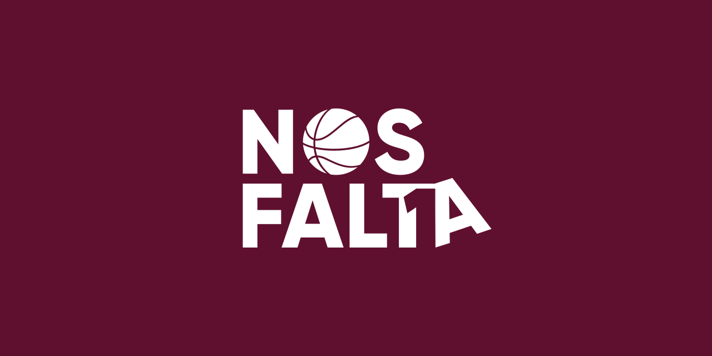

<p align="center">
  
</p>

# NosFaltaUno

## Description

This repository is one of the activities of the [Free Software Club from the University of Córdoba](https://uco.es/aulasoftwarelibre) and has only educational purposes.

"NosFaltaUno" is a notice board that allows you to find people with your same interests.

This repository contains the frontend of the application.

## Getting Started

First, run the development server:

```bash
npm run dev
# or
yarn dev
```

Open [http://localhost:3000](http://localhost:3000) with your browser to see the result.

NosFaltaUno is [AGPL3 licensed](LICENSE).
